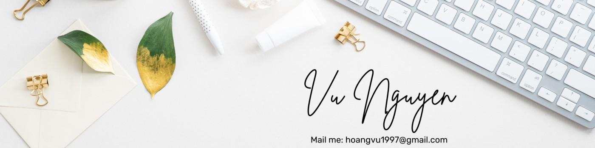

# Hi there! 👋  
  

I'm **Vu Nguyen**, a Mathematics major with a passion for diving into the world of **data science**. My goal is to combine my love for math with coding and data to uncover insights and solve complex problems.  

---

## 🛠️ Skills  
  
  
  
  

---

## 🌱 Currently Learning  
- Building my first data science project 🎯 
- Enhancing skills in Python and SQL  
- Exploring AI and machine learning  

---

## 🌟 Featured Projects  
🚧 *Currently under development!* Stay tuned for updates.  

---

## 📫 Connect with Me  
  
  
  

---

## ⚡ GitHub Stats  
  

---

## 🌟 Fun Facts  
🎹 I’ve been learning piano for 20 years.  
🎲 I enjoy playing Blackjack, Poker, and other casino card games.  

 

